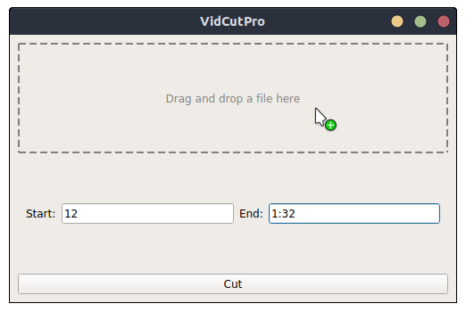

Easy video cutting tool in python using Qt and MPV



## Build instructions

To create the executable, simply run `cp $(which ffmpeg) .; rm -r vidcutpro.spec build dist; pyinstaller --clean --noconfirm --add-binary "ffmpeg:." vidcutpro.py --onefile --noconsole`

## Installation

First build the binary with the build instruction. To install it, move to the git repo and run:

``` bash
# creates desktop file
echo "[Desktop Entry]\nVersion=1.0
Name=VidCutPro\nComment=Easy to use video cutting tool based on mpv and ffmpeg\nExec=${HOME}/.local/bin/vidcutpro.py\nIcon=${HOME}/.local/share/icons/hicolor/1024x1024/apps/vidcutpro.png\nTerminal=false\nType=Application\nCategories=Utility;" > vidcutpro.desktop

# links files to this repo
ln -s ${PWD}/vidcutpro.py ${HOME}/.local/bin/vidcutpro.py
ln -s ${PWD}/assets/logo.png ${HOME}/.local/share/icons/hicolor/1024x1024/apps/vidcutpro.png
ln -s ${PWD}/vidcutpro.desktop ${HOME}/.local/share/applications/vidcutpro.desktop
```
